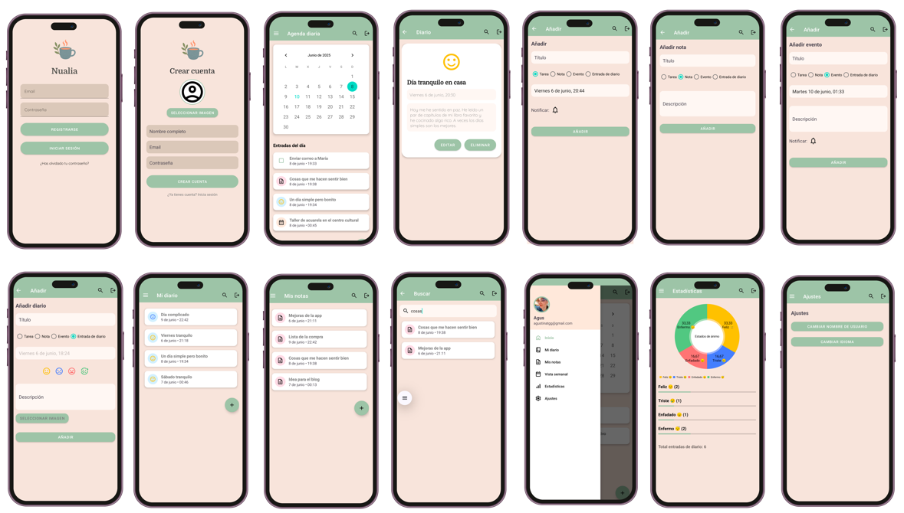

# Nualia | My Final Degree Project

## About Me and This Project

Hi! I'm **,Agustina González Ginares**,, a mobile application developer. Nualia is the result of my Final Course Project for the Higher National Diploma in Multiplatform Application Development (**Grado Superior en Desarrollo de Aplicaciones Multiplataforma**).

Developing Nualia has been an incredibly significant experience for me. My motivation came from seeing the **need for tools that help us manage the fast pace of today's world.** That's why my goal was to create something more than just a task-management app; I wanted to build a **safe and welcoming space that combines daily organization with emotional well-being**—a tool that I would want to use myself.

This project showcases my ability to take an idea from concept to a complete, functional native Android application, applying industry best practices.

## 🚀 What is Nualia?

*Nualia is a personal wellness application that helps you organize your life with a more human approach.* Instead of focusing solely on productivity, I wanted to create a digital companion that allows you to:

- **Manage everything in one place:** Create and organize tasks, events, notes, and diary entries.

- **Connect with your emotions:** Log your mood, add images to your reflections, and see how you've been feeling over time.

- **Plan with calm:** Use a calendar and a weekly view with a clean and relaxing interface, designed to reduce visual stress.

- **Never forget anything important:** Thanks to a scheduled notification system for your tasks and events.

## 🛠️ My Tech Stack and Architecture

To build Nualia, I made technical decisions focused on creating a *clean, scalable, and maintainable codebase*, following Google's recommendations.

- **Architecture:** I implemented an **MVVM** (Model-View-ViewModel) architecture. This choice was key to **separating the business logic from the user interface**, which made testing and component reuse much easier. The UI observes data changes through **LiveData**, ensuring that the information is always up-to-date and lifecycle-aware.

- **Language:** I developed the entire application in **Kotlin**, taking advantage of its modern syntax and null safety to write cleaner, more robust code.

- **Navigation:** I used a **Single-Activity Architecture**, managing all screens as **Fragments with the Jetpack Navigation Component.** This allowed me to create a smooth and secure navigation flow between the different parts of the app.

- **Backend as a Service (BaaS):** I relied completely on Firebase to manage the backend:

  - **Firebase Firestore:** As a **real-time NoSQL database.** It was an interesting challenge to structure the data to ensure user privacy, where each person can only access their own information.

  - **Firebase Authentication:** To implement a **secure authentication flow** (registration, login, and password recovery).

  - **Firebase Storage:** For **storing images**, such as profile pictures and those in diary entries.

## Key Libraries:

- **MPAndroidChart:** For data visualization. It allowed me to **transform logged emotions into dynamic and aesthetically pleasing pie charts** that matched the app's design.

- **Glide:** For efficient loading and caching of images from Firebase.

- **AlarmManager and BroadcastReceiver:** Implementing **notifications** was one of the biggest challenges, especially with the restrictions in modern Android versions. I managed to create a reliable system that works even when the app is closed.

## 🌱 What I Learned and Future Steps

Nualia has taught me **how to tackle real-world development problems, to research official documentation, and to refactor my own code without fear.** Although I am very proud of the result, I am always thinking about **how I could improve it.** Some ideas I would like to explore in the future are:

- **Cross-Platform Sync:** Creating a desktop version for a continuous experience.

- **Full Offline Mode:** Improving caching so the app is fully functional without an internet connection.

- **Data Export:** Allowing users to export their entries to PDF, giving them full control over their information.

Thank you for taking the time to review my project. I hope you like it!
